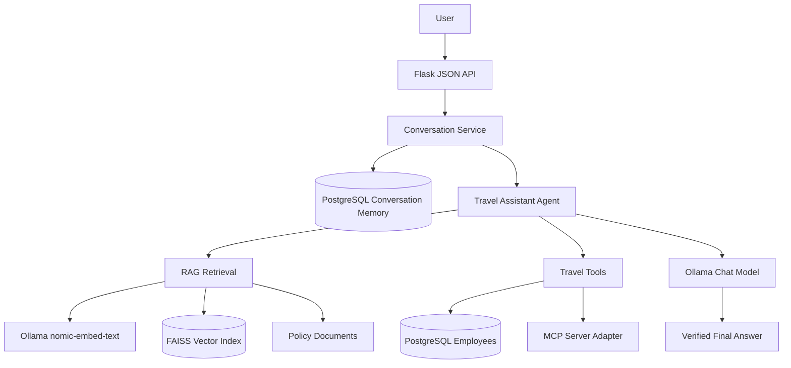

# AI Travel and Policy Assistant

A fictional corporate travel assistant that combines policy retrieval, deterministic employee and trip tools, local Ollama models, PostgreSQL conversation memory, MCP, and a Flask JSON API.

> All employee and policy information in this repository is fictional training data.

## Business Problem

Employees need quick, reliable answers to questions such as:

- What is the travel limit for India or the United States?
- Are airport or late-night business trips allowed?
- Is an employee eligible for business travel?
- Does a trip require additional approval?
- How much of a trip is reimbursable?
- What happens when a follow-up question refers to a previous trip?

The assistant combines retrieved policy evidence with database-backed business tools. It does not invent rules when the policy collection does not contain supporting information.

## Solution

The application uses four decision paths:

1. **Policy question**: retrieve relevant policy chunks with Ollama embeddings and FAISS.
2. **Eligibility question**: query the PostgreSQL `employees` table.
3. **Trip question**: combine employee eligibility, policy retrieval, trip validation, and reimbursement calculation.
4. **Follow-up question**: load recent messages and structured state from PostgreSQL before routing the request.

Ollama generates the final natural-language response using verified tool results and retrieved policy context.

## Architecture



The MCP server exposes the same tools through the Model Context Protocol. The Flask agent currently uses the Python tools directly; the MCP client test proves that the tools can also be discovered and invoked through MCP stdio.

## Repository Structure

```text
.
├── app/
│   └── app.py                         Flask JSON API
├── data/
│   ├── company_policy/                Fictional policy documents
│   └── employees.csv                  Local seed/reference data
├── mcp/
│   └── server.py                      MCP 2.x tool server
├── scripts/
│   ├── chat.py                        Interactive terminal client
│   ├── test_agent.py                  Agent smoke test
│   ├── test_api.py                    Flask API test
│   ├── test_conversation_service.py   Persistent follow-up test
│   ├── test_ingestion.py              Ingestion test
│   ├── test_mcp.py                    MCP registration test
│   ├── test_mcp_client.py             MCP stdio integration test
│   ├── test_memory.py                 PostgreSQL memory test
│   ├── test_prompts.py                Prompt template test
│   ├── test_retrieval.py              Embedding and FAISS test
│   ├── test_scenarios.py              19 acceptance scenarios
│   └── test_tools.py                  Database tools test
├── src/
│   ├── agent.py                       Routing and Ollama answer generation
│   ├── conversation_service.py        Memory-aware request orchestration
│   ├── database.py                    PostgreSQL employee access
│   ├── embeddings.py                  Ollama embeddings and FAISS store
│   ├── ingestion.py                   Cleaning, metadata, and chunking
│   ├── memory.py                      PostgreSQL conversation memory
│   ├── prompts.py                     P.T.C.F. and structured prompts
│   ├── rag.py                         Policy retrieval and context building
│   └── tools.py                       Eligibility and trip tools
└── requirements.txt
```

## Technology Stack

- Python 3.12
- Flask
- PostgreSQL and psycopg2
- SQLAlchemy
- Ollama
  - `nomic-embed-text` for embeddings
  - `qwen2.5:1.5b` for final responses
- FAISS for local vector search
- LangChain Ollama integration
- Model Context Protocol SDK 2.x
- Pandas and NumPy

## Setup

### 1. Create the environment

Use one project environment named `venv`:

```bash
python3.12 -m venv venv
source venv/bin/activate
python -m pip install -r requirements.txt
```

Python 3.12 is recommended because the FAISS and NumPy stack is tested with it.

### 2. Install and start Ollama

Install Ollama for macOS, then make sure the service is running:

```bash
ollama serve
```

In another terminal, download the models:

```bash
ollama pull nomic-embed-text
ollama pull qwen2.5:1.5b
```

Check installed models:

```bash
ollama list
```

### 3. Configure PostgreSQL

The application expects the following database tables:

- `employees`
- `conversations`
- `conversation_messages`
- `conversation_state`
- `trip_validations` may also exist for trip audit data

Create `.env` in the repository root. Do not commit it.

```env
DATABASE_URL=postgresql+psycopg2://nineleaps@localhost:5432/travel_assistant_db
```

The current local PostgreSQL employee table uses:

```text
employee_id
country
employee_type
status
manager_approval
created_at
```

The application maps `status` to the assistant's eligibility status. Supported values include `Eligible`, `Approval Required`, and `Not Eligible`.

### 4. Verify the database

```bash
psql -h localhost -p 5432 -U nineleaps -d travel_assistant_db
```

Inside `psql`:

```sql
\dt
\d employees
\d conversations
\d conversation_messages
\d conversation_state
```

## RAG Workflow

```text
Policy text files
      ↓
Whitespace cleaning and metadata assignment
      ↓
Character-based chunks with overlap
      ↓
Ollama nomic-embed-text embeddings
      ↓
FAISS inner-product index
      ↓
Top-k semantic retrieval
      ↓
Minimum relevance threshold
      ↓
Verified context for Ollama
      ↓
Answer plus source filenames
```

The current ingestion configuration uses a chunk size of 400 characters and an overlap of 50 characters. The overlap helps preserve context across chunk boundaries while keeping the index small for the training dataset.

A minimum similarity score of `0.70` prevents weak matches from being passed to the answer generator. Unsupported examples such as hotel reimbursement, rental cars, and maximum flight ticket prices return an unavailable-information response.

## Agent Workflow

The agent is deliberately deterministic about tool selection:

```text
Question
   ├── Policy question → RAG
   ├── Employee question → check_employee_eligibility
   └── Trip question → eligibility + RAG + validate_trip + reimbursement
```

The LLM is used for final wording, not for bypassing the validation rules. If Ollama is unavailable or fails, the agent returns a deterministic fallback based on the verified evidence.

### Tools

`check_employee_eligibility(employee_id)` returns employee status, country, employee type, and eligibility flag.

`validate_trip(employee_id, trip_type, amount, time)` checks employee status, country spending limits, and late-night approval requirements.

`calculate_reimbursement(trip_amount, policy_limit)` returns the reimbursable amount and amount requiring review.

Current policy limits used by the deterministic validator:

```text
India          INR 2,000 per individual ride
United States  USD 75 per individual ride
```

## Conversation Memory

Conversation memory uses a stable `conversation_id`. A new ID is created for a new chat, while follow-up messages in the same chat reuse the existing ID.

```text
conversations
    conversation_id, user_id, created_at, updated_at, status

conversation_messages
    message_id, conversation_id, role, content, created_at

conversation_state
    conversation_id, state_json, updated_at
```

Only the latest six messages are loaded into the application context by default. The full history remains in PostgreSQL. Important structured values such as employee ID, country, trip type, and amount are saved in `state_json`, which is smaller and more reliable than sending the entire history to the LLM.

Returning the next day can continue the same conversation as long as the client retains the same `conversation_id`. Starting a new chat creates a new ID.

## MCP

MCP means Model Context Protocol. The MCP server is a standard tool gateway around the existing business functions.

```text
MCP client
    ↓ stdio
mcp/server.py
    ↓
src/tools.py
    ↓
PostgreSQL
```

The server exposes:

- `check_employee_eligibility`
- `validate_trip`
- `calculate_reimbursement`

The project uses the MCP 2.x `MCPServer` API. The client integration test starts the server as a subprocess, discovers its tools, invokes all three, and verifies the results.

## Flask Backend API

Start the backend:

```bash
source venv/bin/activate
python app/app.py
```

Available routes:

```text
GET  /health
POST /conversations
POST /ask
GET  /conversations/<conversation_id>/messages
POST /conversations/<conversation_id>/clear
```

Create a conversation:

```bash
curl -X POST http://127.0.0.1:5000/conversations \
  -H "Content-Type: application/json" \
  -d '{"user_id":"EMP001"}'
```

Ask a question using the returned ID:

```bash
curl -X POST http://127.0.0.1:5000/ask \
  -H "Content-Type: application/json" \
  -d '{
    "conversation_id":"PASTE_CONVERSATION_ID",
    "employee_id":"EMP001",
    "question":"What is the India travel limit?"
  }'
```

The response includes the answer, route, sources, retrieved chunks, tool results when applicable, recent messages, and stored state.

### Policy upload

The Assistant composer includes a `+` upload action for fictional `.txt` policy documents:

```bash
curl -X POST http://127.0.0.1:5000/policies/upload \
      -F "file=@data/company_policy/new_policy.txt"
```

Uploaded files are validated for extension, UTF-8 encoding, non-empty content, and a 1 MB size limit. They are stored in `data/company_policy_pending/` and marked as pending review. They are **not** added to the active RAG index and cannot affect answers until an approval workflow is implemented.

The UI displays:

```text
Document uploaded and awaiting review. It will not affect answers yet.
```

This separation prevents an arbitrary external document from silently changing policy answers.

### Employee and manager usage

Employee ID is optional in the training environment:

- Employees can enter an ID such as `EMP001` for personalized eligibility and trip checks.
- Managers can leave the field blank and ask questions about another employee, for example: `Can EMP001 take an airport trip?`
- Employee IDs are normalized to uppercase, so `emp001` and `EMP001` resolve consistently.

When an Employee ID is entered, the sidebar loads recent conversations associated with that ID. Selecting a conversation reopens its stored messages. This is intentionally open for testing; production must enforce authentication and conversation ownership.

### Frontend views

The Flask frontend currently provides:

- **Assistant**: chat, policy answers, tools, sources, decision trace, and uploads.
- **Policy library**: read-only policy document index.
- **Employee profile**: read-only employee context including ID, country, type, and status.
- **Previous conversations**: recent conversation IDs for the entered Employee ID.

The frontend uses the same Flask API and PostgreSQL memory layer as the terminal client.

## Terminal Chat Client

For interactive testing without the frontend:

```bash
source venv/bin/activate
PYTHONPATH=src python scripts/chat.py
```

Example:

```text
Employee ID (optional): EMP001
You: Can I take an airport trip?
You: What if it costs INR 2,500?
You: exit
```

## Testing

Run the focused checks:

```bash
PYTHONPATH=src python scripts/test_ingestion.py
PYTHONPATH=src python scripts/test_prompts.py
PYTHONPATH=src python scripts/test_retrieval.py
PYTHONPATH=src python scripts/test_tools.py
PYTHONPATH=src python scripts/test_conversation_service.py
PYTHONPATH=src:. python scripts/test_mcp.py
PYTHONPATH=src:. python scripts/test_mcp_client.py
python scripts/test_api.py
PYTHONPATH=src python scripts/test_scenarios.py
python scripts/test_policy_upload.py
```

The acceptance suite covers 19 cases across:

- India and United States policy questions
- Airport and late-night travel
- Required expense information
- Eligible, approval-required, and ineligible employees
- Unknown employee IDs
- Trips below and above country limits
- Reimbursement calculations
- Unsupported hotel, flight, and rental-car questions
- Empty questions
- Negative trip amounts

## Prompt Engineering

The prompt templates in `src/prompts.py` demonstrate:

- **P.T.C.F.**: persona, task, context, and format
- Role-based prompting for a corporate travel analyst
- Few-shot classification examples
- Structured JSON output
- Explicit grounding constraints to reduce hallucination

The classification prompt categorizes requests as policy question, eligibility check, trip validation, reimbursement, or unsupported. The summary prompt extracts policy rules, limits, and approval requirements into structured JSON.

## Error Handling

The backend handles:

- Empty questions with a client error
- Missing API fields with HTTP 400
- Invalid message roles
- Invalid time formats
- Negative trip amounts
- Unknown employee IDs
- Retrieval misses with an unavailable-information response
- Unexpected API failures with a generic HTTP 500 response

Technical exception details are logged server-side and are not returned to API users.

## Current Limitations

- Employee records are read from PostgreSQL, but migrations are not yet automated.
- FAISS is currently built in memory when the RAG service starts; persistent vector-index loading can be added later.
- The agent uses deterministic keyword routing rather than an LLM planner.
- MCP is exposed and integration-tested, but the Flask agent currently calls Python tools directly rather than routing every tool call through an MCP client.
- Authentication, authorization, rate limiting, and request tracing are not implemented.
- Conversation summarization for very long histories is not implemented; the application currently uses bounded recent history plus structured state.
- Uploaded policy documents currently require a future review/approval workflow before becoming active.
- The frontend is connected to the backend API, but the Policy library view is currently read-only.
- Policy answers depend on the fictional documents in `data/company_policy` and are not a substitute for real corporate policy guidance.

## Security Notes

- Keep `.env` out of Git.
- Do not place real employee data or private company policy in this training repository.
- Use a dedicated PostgreSQL role with only the permissions required by the application.
- Validate and authenticate conversation ownership before exposing persistent conversation endpoints in a production deployment.
- Keep MCP tools deterministic and validate all tool inputs before database writes or business decisions.
